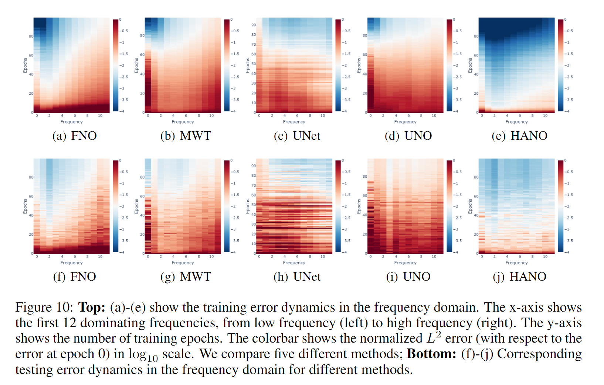
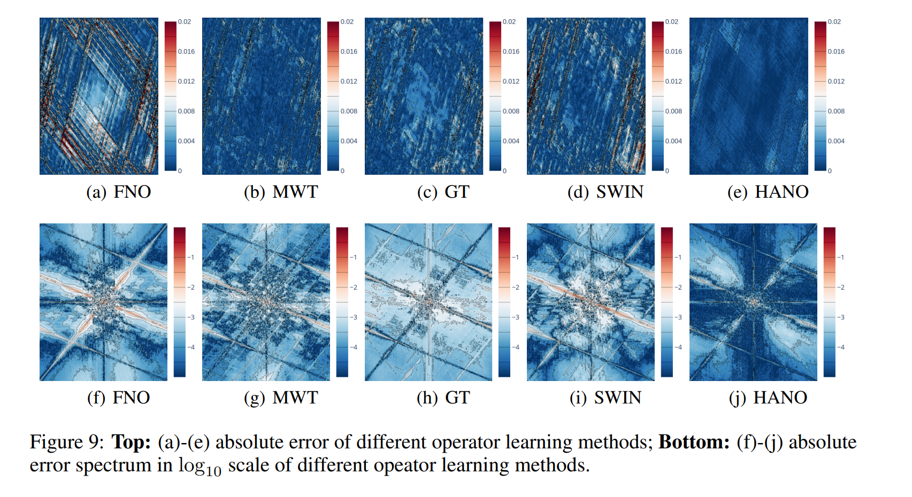
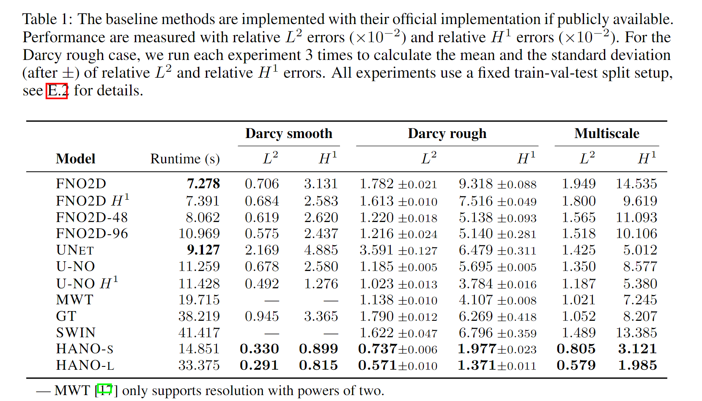

# HANO — Hierarchical Attention Neural Operator
### Journal of Computational Physics (2024) · Mitigating Spectral Bias for Multiscale Operator Learning

[](LICENSE.txt)
[](https://python.org)
[](https://pytorch.org)

> **Featured paper:** Liu, X., Xu, B., Cao, S., & Zhang, L. (2024). *Mitigating spectral bias for the multiscale operator learning*. Journal of Computational Physics, 506, 112944. ([ScienceDirect](https://doi.org/10.1016/j.jcp.2024.112944))

---

## Overview

Neural operators learn mappings between infinite-dimensional function spaces and have emerged as powerful surrogate solvers for PDEs. However, standard spectral-based operators (e.g., FNO) suffer from **spectral bias** — they preferentially fit low-frequency components and struggle with multiscale or rough solutions.

**HANO** now uses a **multigrid-attention backbone**:
- A **patch embedding stem** lifts the input field into a latent channel space.
- A stack of **multigrid attention blocks** performs local attention updates, restricts the state to coarser resolutions, and upsamples it back to the finest grid.
- A **final convolution head** maps the refined latent state back to the target field.

Each multigrid block follows a coarse-to-fine hierarchy: it applies attention updates at the current level, restricts the state to the next coarser level, and then reconstructs the fine-scale prediction with transpose-convolution skip connections.

```
Input field (B, 1, H, W)
       │
  PatchEmbed (Conv2d)
       │
 MultigridAttentionBlock × N
 ├─ Attention smoothing at each level
 ├─ Restriction to coarser grids
 └─ Transposed-conv reconstruction to fine grids
       │
 Output projection (Conv2d)
       │
Output field (B, H_out, W_out, 1)
```

### Why does it work?
Attention still operates locally in the spatial domain, so the model does not inherit the low-frequency bias of purely spectral decoders. The multigrid hierarchy lets the network exchange information across coarse and fine resolutions while keeping the implementation fully convolutional.

---

## Repository Structure

```
HANO/
├── hano/                  # Core Python package
│   ├── models/            # Active multigrid HANO/FNO models and legacy HANO snapshot
│   ├── losses.py          # H¹ (Sobolev) loss and Lp loss
│   ├── data.py            # Dataset loaders and normalizers
│   ├── trainer.py         # Training & evaluation loops
│   └── utils.py           # Logging helpers
├── experiments/           # Experiment entry-point scripts
├── scripts/               # train.py / eval.py CLI wrappers
├── spectral_bias/         # Spectral bias analysis notebook & data
├── environment.yml
└── requirements.txt
```

---

## Installation

### Option A — pip (editable)
```bash
git clone https://github.com/xlliu2017/HANO.git
cd HANO
pip install -e .          # or: pip install -r requirements.txt
```

### Option B — conda
```bash
conda env create -f environment.yml
conda activate hano
```

**Core dependencies:** PyTorch ≥ 1.12, timm, scipy, h5py, tqdm, torchinfo.

---

## Datasets

Data is courtesy of [Zongyi Li (Caltech)](https://github.com/zongyi-li/fourier_neural_operator) under the MIT license.

| Experiment | Files | Download |
|---|---|---|
| Darcy smooth | `piececonst_r421_N1024_smooth1/2.mat` | [Google Drive](https://drive.google.com/drive/folders/1UnbQh2WWc6knEHbLn-ZaXrKUZhp7pjt-?usp=sharing) |
| Darcy rough | `darcy_rough_{train,val,test}.mat`, `darcy_alpha2_tau18_c3_512_test.mat` | [Google Drive](https://drive.google.com/drive/folders/1ovfK0CV6n_UUqt4tAtaxo_-9nRshhZC7?usp=sharing) |
| Multiscale trig. coeff. | `mul_tri_{train,val,test}.mat` | [Google Drive](https://drive.google.com/drive/folders/1ovfK0CV6n_UUqt4tAtaxo_-9nRshhZC7?usp=sharing) |
| Navier–Stokes | `NavierStokes_V1e-{3,4,5}_N*_T*.mat` | [Google Drive](https://drive.google.com/drive/folders/1UnbQh2WWc6knEHbLn-ZaXrKUZhp7pjt-?usp=sharing) |

Place all `.mat` files inside `./data/`.

---

## Pre-trained Models

Download from [Google Drive](https://drive.google.com/drive/folders/1Tnjh7Vnr_lmdYpePl60ZHuYTzfcz_8Zl?usp=share_link) and place in `./models/`:

| Checkpoint | Trained on | Resolution |
|---|---|---|
| [darcyrough_res256.pt](https://drive.google.com/file/d/14GQMdM573oCNIJNWO_pcvUpTim7vmw0O/view?usp=share_link) | Darcy rough (§4.2) | 256 |
| [multiscale_res256.pt](https://drive.google.com/file/d/1uPX38qqEastYhp7_iH3MbHB0PSXP6lDc/view?usp=share_link) | Multiscale trig. coeff. (§4.2) | 256 |
| [FNO_multiscale_res256.pt](https://drive.google.com/file/d/1MZAIQhBjVh0-ja-Q6vi17kxYl9X5pKTw/view?usp=share_link) | Multiscale (FNO baseline) | 256 |

---

## Training

The experiment entrypoints under `experiments/` remain the supported training interface. The previous hierarchical-transformer + spectral-decoder stack is preserved in `hano/models/hano_legacy.py` for reference.

```bash
# Darcy smooth  (res = 211)
python experiments/ex_darcysmooth.py

# Darcy rough   (res = 256)
python experiments/ex_darcyrough.py

# Multiscale trigonometric coefficient  (res = 256)
python experiments/ex_multiscale.py

# Navier–Stokes
python experiments/ex_ns.py

# FNO baseline on multiscale
python experiments/ex_fno_multiscale.py
```

Checkpoints and training logs are saved to `./models/`.

---

## Evaluation

```bash
python scripts/eval.py
```

Results are written to `./results/` as `.mat` files that can be loaded with MATLAB or `scipy.io.loadmat`.

---

## Spectral Bias Analysis

The spectral bias of different operator-learning methods is visualized in the notebook:

```
spectral_bias/spectral_bias_dynamics.ipynb
```

Pre-computed dynamics data (`.npz`) for FNO, HANO, MWT and UNO are included.



---

## Benchmark Results

Error-spectrum comparison across operator-learning methods (raw results are also available [here](https://drive.google.com/drive/folders/1mgs-Yc8wz6TDUUw1OtQJc8sMpqLuaoDZ?usp=share_link)):



Quantitative comparison (relative L² and H¹ errors) against baselines:



---

## Citation

If you use this code, please cite:

```bibtex
@article{liu2024mitigating,
  title   = {Mitigating spectral bias for the multiscale operator learning},
  author  = {Liu, X. and Xu, B. and Cao, S. and Zhang, L.},
  journal = {Journal of Computational Physics},
  volume  = {506},
  pages   = {112944},
  year    = {2024},
  doi     = {10.1016/j.jcp.2024.112944}
}
```

---

## License

This project is licensed under the [MIT License](LICENSE.txt).  
Data and baseline code courtesy of Zongyi Li (Caltech) under MIT license.
